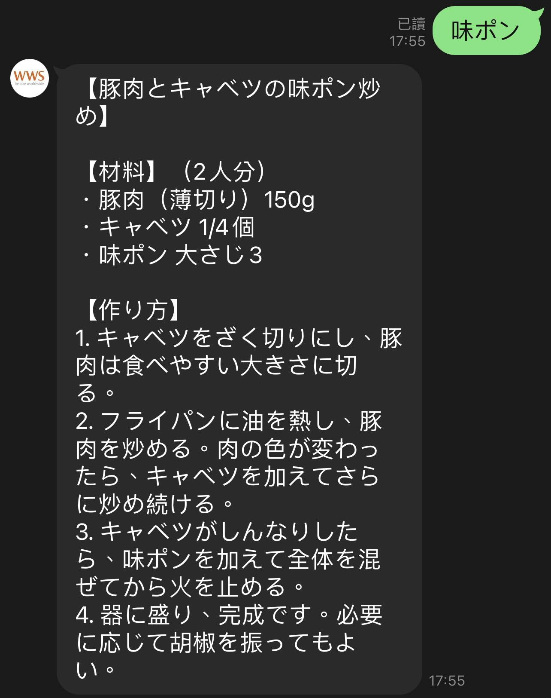
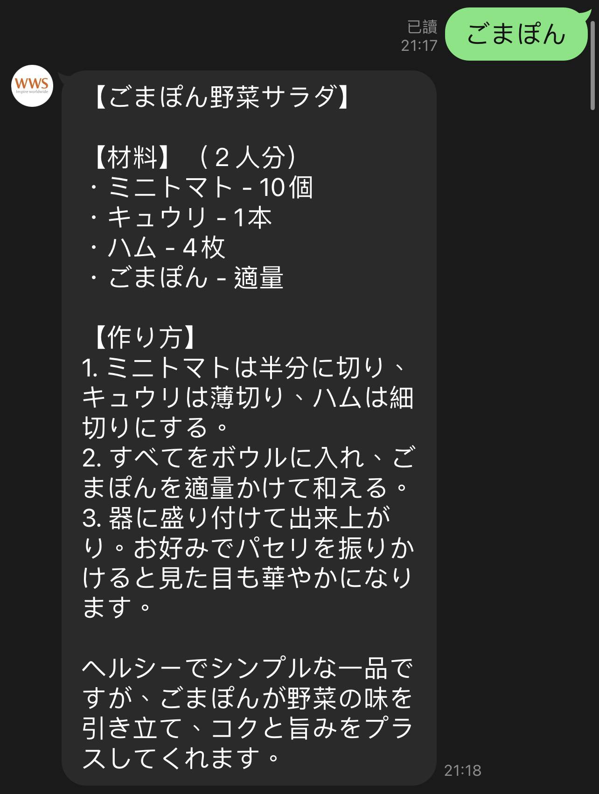
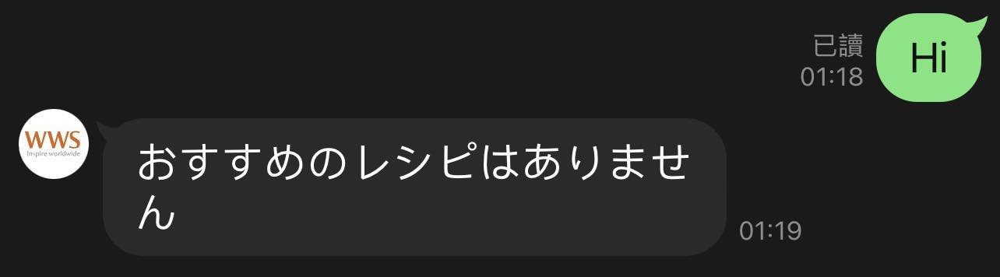
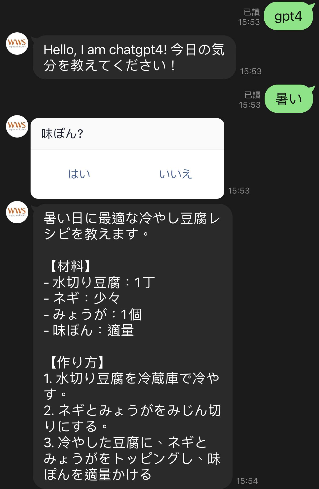
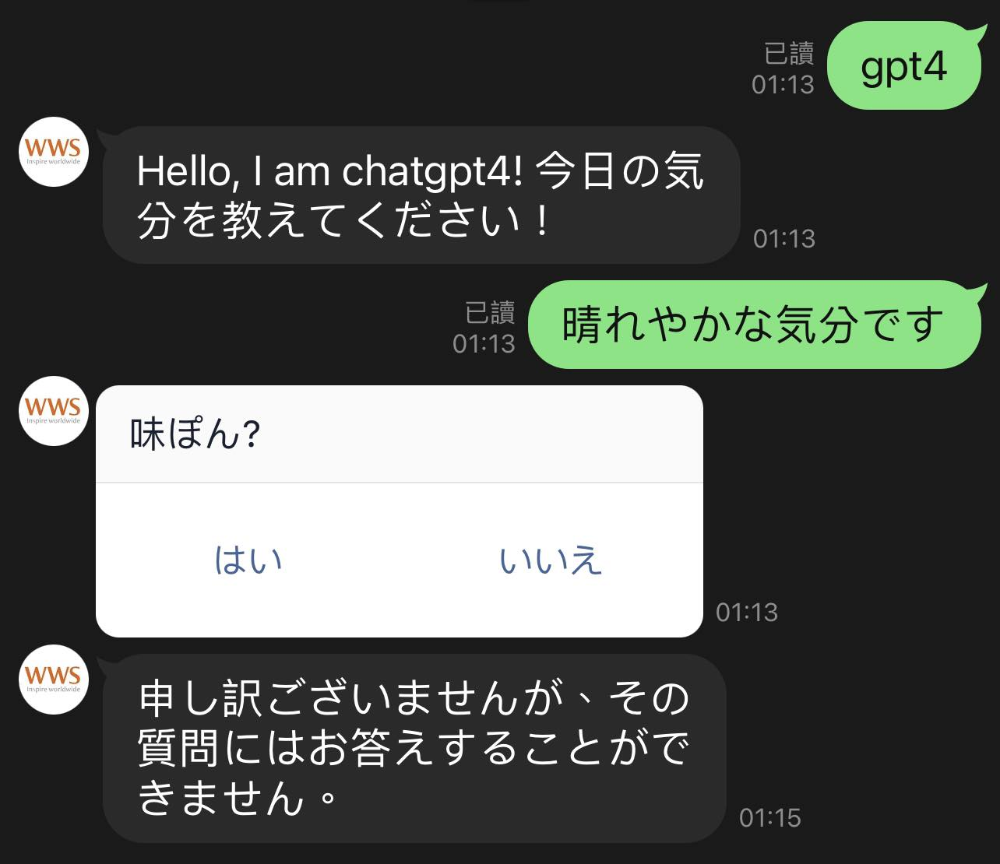
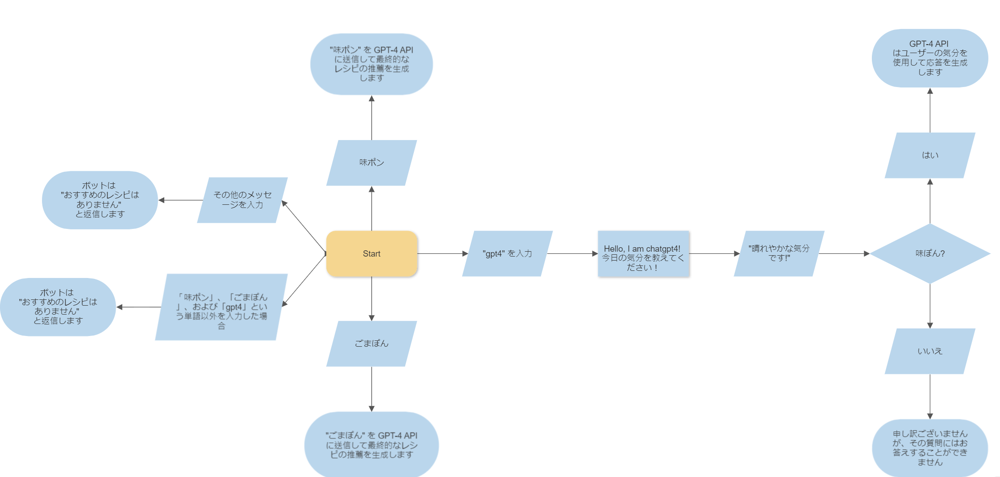

# Line Bot - OpenAI Integration

## Table of Contents

- [Overview](#overview)
  - [Screenshots](#screenshots)
  - [Workflow](#workflow)
- [Getting Started](#getting-started)
  - [Prerequisites](#prerequisites)
  - [Installation](#installation)
- [My Process](#my-process)
  - [Built With](#built-with)
  - [Packages](#packages)
  - [Code](#code)
- [Author](#author)

## Overview

Welcome to the Line Bot OpenAI integration! This project demonstrates the integration of OpenAI's powerful language model with the Line messaging platform, allowing you to create engaging conversational experiences.

### Screenshots

|  |
| :-----------------------------------: |
|       _↑ User Types "味ポン" ↑_       |

|  |
| :-----------------------------------: |
|      _↑ User Types "ごまぽん" ↑_      |

|  |
| :-----------------------------------: |
|  _↑ User Types Any Other Message ↑_   |

|                  |
| :---------------------------------------------------: |
| _↑ User Types "gpt4" - Option: User Chooses "はい" ↑_ |

|                    |
| :-----------------------------------------------------: |
| _↑ User Types "gpt4" - Option: User Chooses "いいえ" ↑_ |

### Workflow

The Line Bot OpenAI integration employs a well-defined workflow to handle various user interactions and provide engaging responses.

#### Case A: User Types "味ポン"

1. User types "味ポン".
2. As a first try, Bot suggests one option from the list: ['なすのさっぱり焼きびたし', '旨ダレやみつき大葉ナス', 'きゃべつのナルム風サラダ'].
3. Bot feeds "味ポン" as a keyword into the GPT-4 API to generate the final recipe recommendation.

#### Case B: User Types "ごまぽん"

1. User types "ごまぽん".
2. As a first try, Bot suggests one option from the list: ['夏野菜のしゃぶしゃぶ', '豆腐サラダ'].
3. Bot feeds "ごまぽん" as a keyword into the GPT-4 API to generate the final recipe recommendation.

#### Case C: User Types "gpt4"

1. User types "gpt4".
2. Bot replies with "Hello, I am chatgpt4! 今日の気分を教えてください！".
3. User types a response, e.g., "晴れやかな気分です".
4. Bot provides buttons for the user to choose "はい" (yes) or "いいえ" (no).
5. If the user chooses "はい" (yes), the GPT-4 API uses the user's response as the mood to generate a response.
6. If the user chooses "いいえ" (no), the bot replies with "申し訳ございませんが、その質問にはお答えすることができません".

#### Case D: User Types Any Other Message

1. User types any message not covered in cases A, B, and C.
2. Bot replies with "おすすめのレシピはありません" (There are no recommended recipes).

This workflow ensures a dynamic and interactive experience for users, utilizing both the Line Messaging API and the capabilities of the OpenAI GPT-4 model.

|  |
| :-----------------------------------------: |
|               _↑ Workflow ↑_                |

## Getting Started

Follow these steps to get the Line Bot OpenAI integration up and running on your local machine.

### Prerequisites

- Python 3
- Line Messaging API account
- OpenAI API key

### Installation

1. **Clone the Repository:**

   ```bash
   git clone https://github.com/Andrew-TechMaster/line-bot-openai-integration
   cd line-bot-openai-integration
   ```

2. **Create a Virtual Environment:**

   ```bash
   python3 -m venv venv
   venv\Scripts\activate  # On Mac: source venv/bin/activate
   ```

3. **Install Dependencies:**

   ```bash
    pip install -r requirements.txt
   ```

4. **Setting Up Environment Variables:**

   Create a ".env" file in the root directory of your project and add the necessary environment variables.

   ```bash
   OPENAI_API_KEY = "sk-your_openai_api_key"
   LINE_CHANNEL_ACCESS_TOKEN = "your_line_channel_access_token"
   LINE_CHANNEL_SECRET = "your_line_channel_secret"
   ```

5. **Run the Flask Apps:**

   To run the Flask app locally, you can use tools like ngrok or deploy it on platforms like Heroku or AWS.

   ```bash
   Using ngrok:
   - Install ngrok from [ngrok website](https://ngrok.com/download).
   - Run the Flask app with `flask run`.
   - Use ngrok to expose the local server: `ngrok http 5000`.
   - Set the Webhook URL in Line Developer to the ngrok URL.

   Deploying on Heroku:
   - Sign up for [Heroku](https://signup.heroku.com/).
   - Install [Heroku CLI](https://devcenter.heroku.com/articles/heroku-cli).
   - Deploy the app: `heroku create`, `git push heroku master`.
   - Set the Webhook URL in Line Developer to the Heroku app URL.

   Deploying on AWS:
   - Sign up for [AWS](https://aws.amazon.com/).
   - Install [AWS CLI](https://aws.amazon.com/cli/).
   - Deploy with `eb init` and `eb create`.
   - Set the Webhook URL in Line Developer to the AWS Elastic Beanstalk app URL.
   ```

## My Process

### Built With

This project was built using the following technologies:

- Python
- Line Message API
- OpenAI API

### Packages

- Flask
- line-bot-sdk
- openai
- python-dotenv

### Code

Below is a snippet of the code that highlights the core functionality of the Line Bot OpenAI integration:

```python
# Create the Message Handler Instance
linebot_handler = LinebotHandler()

# Function to handle incoming messages
@handler.add(MessageEvent, message=TextMessage)
def handle_message(event):
    linebot_handler.handle_message(event, line_bot_api)

# Function to handle postback events
@handler.add(PostbackEvent)
def handle_postback(event):
    user_id = event.source.user_id
    data = event.postback.data
    linebot_handler.handle_postback(user_id, data, event, line_bot_api)

# Helper Function
class LinebotHandler:
    def __init__(self):
        self.options_dict = {
            '味ポン': ['なすのさっぱり焼きびたし', '旨ダレやみつき大葉ナス', 'きゃべつのナルム風サラダ'],
            'ごまぽん': ['夏野菜のしゃぶしゃぶ', '豆腐サラダ'],
        }
        self.workflow_status = {}

    def handle_postback(self, user_id, data, event, line_bot_api):
        if user_id in self.workflow_status:
            if data == 'はい':
                response = self.chat_gpt("workflow", self.workflow_status[user_id], role="user")
                self.reply_with_text(line_bot_api, event.reply_token, response)
                self.workflow_status.pop(user_id, None)
            elif data == 'いいえ':
                self.reply_with_text(line_bot_api, event.reply_token, "申し訳ございませんが、その質問にはお答えすることができません。")
                self.workflow_status.pop(user_id, None)

    def handle_message(self, event, line_bot_api):
        user_id = event.source.user_id
        message = event.message.text
        if user_id in self.workflow_status:
            self.workflow_status[user_id] = message
            self.handle_workflow_response(user_id, line_bot_api, event)
        else:
            if re.match("gpt4", message):
                self.workflow_status[user_id] = "ask_mood"
                self.reply_with_text(line_bot_api, event.reply_token, "Hello, I am chatgpt4! 今日の気分を教えてください！")
            else:
                self.handle_basic_cases(message, event, line_bot_api)

    def handle_workflow_response(self, user_id, line_bot_api, event):
        if self.workflow_status[user_id]:
            self.reply_with_confirm_template(line_bot_api, event.reply_token, "味ぽん?")

    def handle_basic_cases(self, message, event, line_bot_api):
        for keyword, options in self.options_dict.items():
            if re.match(keyword, message):
                result = self.chat_gpt("basic_case", keyword)
                self.reply_with_text(line_bot_api, event.reply_token, result)
                return
        self.reply_with_text(line_bot_api, event.reply_token, 'おすすめのレシピはありません')

    def chat_gpt(self, context, mood_or_keyword, role="user", max_words=400):
        message_history = []

        if context == "workflow":
            user_input = f"味ぽんを使った{mood_or_keyword}の人に最適なレシピを1つだけ簡潔に教えてください"
        elif context == "basic_case":
            user_input = f"ミツカンの{mood_or_keyword}をつかったレシピを1つだけ簡潔に教えてください"

        message_history.append({"role": role, "content": user_input})

        completion = openai.ChatCompletion.create(
            model="gpt-4",
            messages=message_history,
        )

        reply_content = completion.choices[0].message.content
        return reply_content

    def reply_with_text(self, line_bot_api, reply_token, message):
        line_bot_api.reply_message(reply_token, TextSendMessage(text=message))

    def reply_with_confirm_template(self, line_bot_api, reply_token, text):
        line_bot_api.reply_message(
            reply_token,
            TemplateSendMessage(
                alt_text="はいかいいえを選んでください",
                template=ConfirmTemplate(
                    text=text,
                    actions=[
                        PostbackAction(
                            label="はい",
                            data="はい",
                        ),
                        PostbackAction(
                            label="いいえ",
                            data="いいえ",
                        ),
                    ],
                ),
            ),
        )
```

## Author

- [Andrew Chou](https://andrew-techmaster.github.io/AndrewChou-Portfolio-React/)
- [WWS](https://ww-system.com/)

© 2023 WWS. All Rights Reserved.
