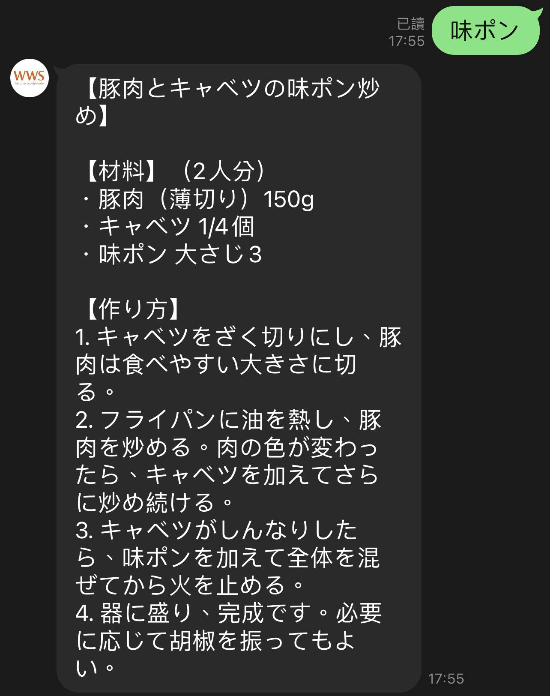
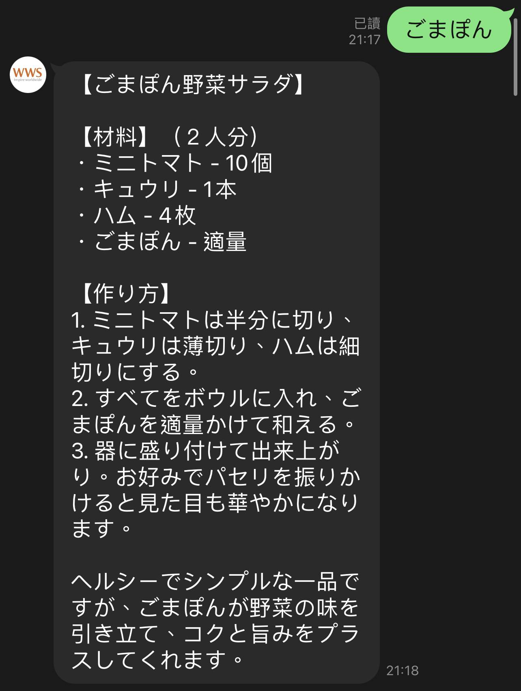
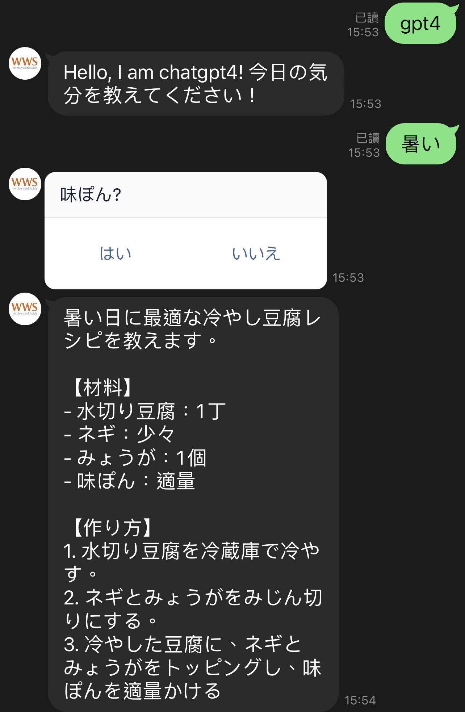
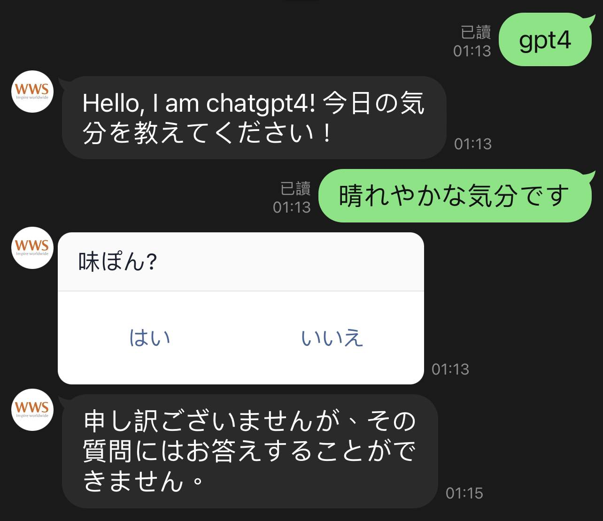
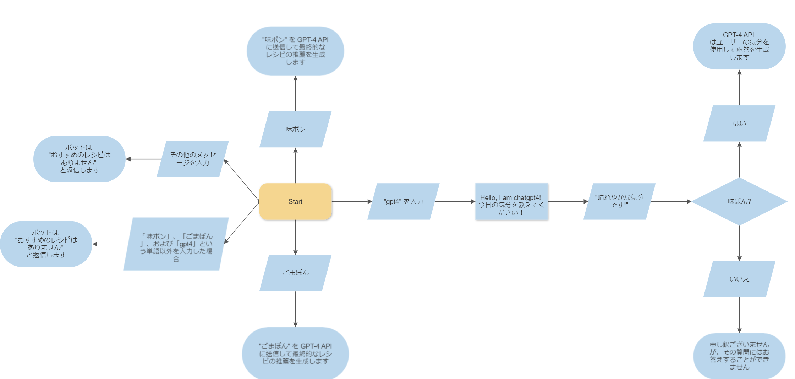

# Line Bot - OpenAI 統合

## 目次

- [概要](#概要)
  - [スクリーンショット](#スクリーンショット)
  - [ワークフロー](#ワークフロー)
- [始めるには](#始めるには)
  - [前提条件](#前提条件)
  - [インストール](#インストール)
- [私のプロセス](#私のプロセス)
  - [使用技術](#使用技術)
  - [パッケージ](#パッケージ)
  - [コード](#コード)
- [著者](#著者)

## 概要

Line Bot OpenAI 統合へようこそ！このプロジェクトは、OpenAI の強力な言語モデルを Line メッセージングプラットフォームと統合し、魅力的な会話体験を作成できるようにします。

### スクリーンショット

|  |
| :-----------------------------------: |
|   _↑ ユーザーが "味ポン" を入力 ↑_    |

|  |
| :-----------------------------------: |
|  _↑ ユーザーが "ごまぽん" を入力 ↑_   |

|     |
| :--------------------------------------: |
| _↑ ユーザーがその他のメッセージを入力 ↑_ |

|                                  |
| :-------------------------------------------------------------------: |
| _↑ ユーザーが "gpt4" を入力 - オプション：ユーザーが "はい" を選択 ↑_ |

|                                    |
| :---------------------------------------------------------------------: |
| _↑ ユーザーが "gpt4" を入力 - オプション：ユーザーが "いいえ" を選択 ↑_ |

### ワークフロー

Line Bot OpenAI 統合は、さまざまなユーザーの対話を処理し、魅力的な応答を提供するための明確なワークフローを使用しています。

#### ケース A: ユーザーが "味ポン" を入力

1. ユーザーが "味ポン" を入力します。
2. 最初の試みとして、ボットはリストから 1 つのオプションを提案します：['なすのさっぱり焼きびたし', '旨ダレやみつき大葉ナス', 'きゃべつのナルム風サラダ']。
3. ボットは "味ポン" をキーワードとして GPT-4 API に送信し、最終的なレシピの推薦を生成します。

#### ケース B: ユーザーが "ごまぽん" を入力

1. ユーザーが "ごまぽん" を入力します。
2. 最初の試みとして、ボットはリストから 1 つのオプションを提案します：['夏野菜のしゃぶしゃぶ', '豆腐サラダ']。
3. ボットは "ごまぽん" をキーワードとして GPT-4 API に送信し、最終的なレシピの推薦を生成します。

#### ケース C: ユーザーが "gpt4" を入力

1. ユーザーが "gpt4" を入力します。
2. ボットは "こんにちは、私は chatgpt4 です！ 今日の気分を教えてください！" と返信します。
3. ユーザーが応答を入力します（例："晴れやかな気分です"）。
4. ボットは、ユーザーが "はい" または "いいえ" を選択するためのボタンを提供します。
5. ユーザーが "はい" を選択した場合、GPT-4 API はユーザーの応答を気分として使用して応答を生成します。
6. ユーザーが "いいえ" を選択した場合、ボットは "申し訳ございませんが、その質問にはお答えすることができません。" と返信します。

#### ケース D: ユーザーがその他のメッセージを入力

1. ユーザーがケース A、B、C でカバーされていないメッセージを入力します。
2. ボットは "おすすめのレシピはありません" と返信します。

このワークフローにより、ユーザーに対して動的でインタラクティブな体験を提供し、Line Messaging API と OpenAI GPT-4 モデルの機能を活用しています。

|  |
| :-----------------------------------------: |
|             _↑ ワークフロー ↑_              |

## 始めるには

以下の手順に従って、Line Bot OpenAI 統合をローカルマシンでセットアップして実行します。

### 前提条件

- Python 3
- Line Messaging API アカウント
- OpenAI API キー

### インストール

1. **リポジトリのクローン:**

   ```bash
   git clone https://github.com/Andrew-TechMaster/line-bot-openai-integration
   cd line-bot-openai-integration
   ```

2. **仮想環境の作成:**

   ```bash
   python3 -m venv venv
   venv\Scripts\activate  # Macの場合：source venv/bin/activate
   ```

3. **依存関係のインストール:**

   ```bash
    pip install -r requirements.txt
   ```

4. **環境変数の設定:**

   プロジェクトのルートディレクトリに ".env" ファイルを作成し、必要な環境変数を追加します。

   ```bash
   OPENAI_API_KEY = "sk-your_openai_api_key"
   LINE_CHANNEL_ACCESS_TOKEN = "your_line_channel_access_token"
   LINE_CHANNEL_SECRET = "your_line_channel_secret"
   ```

5. **Flask アプリの実行:**

   Flask アプリをローカルで実行するには、ngrok などのツールを使用するか、Heroku や AWS などのプラットフォームにデプロイします。

   ```bash
   ngrokを使用する場合:
   - [ngrokのウェブサイト](https://ngrok.com/download)からngrokをインストールします。
   - Flaskアプリを `flask run` で実行します。
   - ngrokを使用してローカルサーバーを公開します： `ngrok http 5000`。
   - Line DeveloperでWebhook URLをngrokのURLに設定します。

   Herokuにデプロイする場合:
   - [Herokuにサインアップ](https://signup.heroku.com/)します。
   - [Heroku CLI](https://devcenter.heroku.com/articles/heroku-cli)をインストールします。
   - アプリをデプロイします： `heroku create`、`git push heroku master`。
   - Line DeveloperでWebhook URLをHerokuアプリのURLに設定します。

   AWSにデプロイする場合:
   - [AWSにサインアップ](https://aws.amazon.com/)します。
   - [AWS CLI](https://aws.amazon.com/cli/)をインストールします。
   - `eb init` と `eb create` でアプリをデプロイします。
   - Line DeveloperでWebhook URLをAWS Elastic BeanstalkアプリのURLに設定します。
   ```

## 私のプロセス

### 使用技術

このプロジェクトは次の技術を使用して構築されました：

- Python
- Line Message API
- OpenAI API

### パッケージ

- Flask
- line-bot-sdk
- openai
- python-dotenv

### コード

以下は、Line Bot OpenAI 統合のコア機能を示すコードの一部です：

```python
# メッセージハンドラインスタンスの作成
linebot_handler = LinebotHandler()

# 受信メッセージを処理する関数
@handler.add(MessageEvent, message=TextMessage)
def handle_message(event):
    linebot_handler.handle_message(event, line_bot_api)

# ポストバックイベントを処理する関数
@handler.add(PostbackEvent)
def handle_postback(event):
    user_id = event.source.user_id
    data = event.postback.data
    linebot_handler.handle_postback(user_id, data, event, line_bot_api)

# ヘルパー関数
class LinebotHandler:
    def __init__(self):
        self.options_dict = {
            '味ポン': ['なすのさっぱり焼きびたし', '旨ダレやみつき大葉ナス', 'きゃべつのナルム風サラダ'],
            'ごまぽん': ['夏野菜のしゃぶしゃぶ', '豆腐サラダ'],
        }
        self.workflow_status = {}

    def handle_postback(self, user_id, data, event, line_bot_api):
        if user_id in self.workflow_status:
            if data == 'はい':
                response = self.chat_gpt("workflow", self.workflow_status[user_id], role="user")
                self.reply_with_text(line_bot_api, event.reply_token, response)
                self.workflow_status.pop(user_id, None)
            elif data == 'いいえ':
                self.reply_with_text(line_bot_api, event.reply_token, "申し訳ございませんが、その質問にはお答えすることができません。")
                self.workflow_status.pop(user_id, None)

    def handle_message(self, event, line_bot_api):
        user_id = event.source.user_id
        message = event.message.text
        if user_id in self.workflow_status:
            self.workflow_status[user_id] = message
            self.handle_workflow_response(user_id, line_bot_api, event)
        else:
            if re.match("gpt4", message):
                self.workflow_status[user_id] = "ask_mood"
                self.reply_with_text(line_bot_api, event.reply_token, "Hello, I am chatgpt4! 今日の気分を教えてください！")
            else:
                self.handle_basic_cases(message, event, line_bot_api)

    def handle_workflow_response(self, user_id, line_bot_api, event):
        if self.workflow_status[user_id]:
            self.reply_with_confirm_template(line_bot_api, event.reply_token, "味ぽん?")

    def handle_basic_cases(self, message, event, line_bot_api):
        for keyword, options in self.options_dict.items():
            if re.match(keyword, message):
                result = self.chat_gpt("basic_case", keyword)
                self.reply_with_text(line_bot_api, event.reply_token, result)
                return
        self.reply_with_text(line_bot_api, event.reply_token, 'おすすめのレシピはありません')

    def chat_gpt(self, context, mood_or_keyword, role="user", max_words=400):
        message_history = []

        if context == "workflow":
            user_input = f"味ぽんを使った{mood_or_keyword}の人に最適なレシピを1つだけ簡潔に教えてください"
        elif context == "basic_case":
            user_input = f"ミツカンの{mood_or_keyword}をつかったレシピを1つだけ簡潔に教えてください"

        message_history.append({"role": role, "content": user_input})

        completion = openai.ChatCompletion.create(
            model="gpt-4",
            messages=message_history,
        )

        reply_content = completion.choices[0].message.content
        return reply_content

    def reply_with_text(self, line_bot_api, reply_token, message):
        line_bot_api.reply_message(reply_token, TextSendMessage(text=message))

    def reply_with_confirm_template(self, line_bot_api, reply_token, text):
        line_bot_api.reply_message(
            reply_token,
            TemplateSendMessage(
                alt_text="はいかいいえを選んでください",
                template=ConfirmTemplate(
                    text=text,
                    actions=[
                        PostbackAction(
                            label="はい",
                            data="はい",
                        ),
                        PostbackAction(
                            label="いいえ",
                            data="いいえ",
                        ),
                    ],
                ),
            ),
        )

```

## 著者

- [Andrew Chou](https://andrew-techmaster.github.io/AndrewChou-Portfolio-React/)
- [WWS](https://ww-system.com/)

© 2023 WWS. All Rights Reserved.
